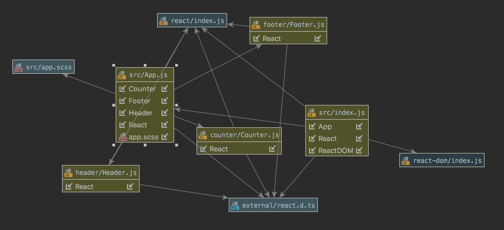

# LAB - 27

## React Testing and Deployment

### Author: Austin Hedeen

### Links and Resources
* [submission PR](https://github.com/austinhedeen-401-advanced-javascript/lab-27/pull/1)
* [travis](https://travis-ci.com/austinhedeen-401-advanced-javascript/lab-27)
* [Netlify deployment](https://boring-lovelace-9ebdd8.netlify.com/)
* [Amplify deployment](https://react-testing.d238kxf281v07k.amplifyapp.com/)

#### Running the app
* `npm start`

#### Tests
* `npm test`

#### UML

